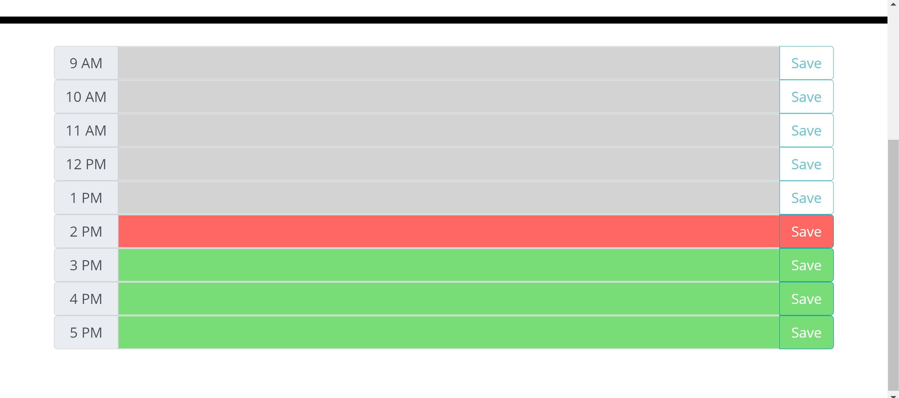

# Work Day Scheduler Starter Code

Work Day Scheduler is an application to store "to do" lists of functions that you want to accomplish day by day.

The Application:

The rows are colored red if it is the current hour, green if it follows, and grey if it preceeds:

